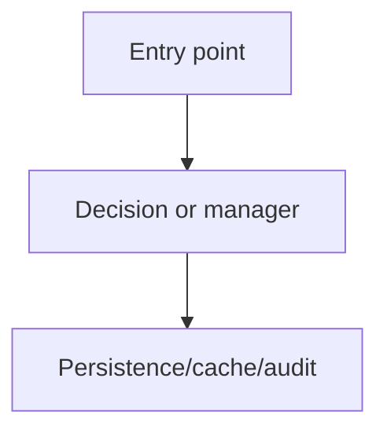

# Feature Scoping Template

Start here in Phase 2, then adjust based on depth calibration.

````markdown
# <Feature Name> Technical Scoping

## 0. Scope And Conventions

<What this doc covers, what it defers to the design doc/pre-work docs, and citation conventions.>

## 1. Current-State Inventory

Group by surfaces relevant to this feature.

| Area | Code reference | What exists today | Why it matters |
|---|---|---|---|
| <area> | `<file>` or `<file:symbol>` | <current behavior> | <impact> |

## 2. Target Flow

Use Mermaid diagrams when relationships are easier to understand visually.



## 3. Backend Work

Include this section at the selected backend depth.

For interface depth, each subsection should include:

- relevant current files,
- target responsibility split,
- method/interface names,
- removed or renamed methods,
- execution-order implications.

## 4. Frontend Work

Include this section at the selected frontend depth.

Calibrate whether this is:

- user-facing goals only,
- route/component/query boundaries,
- or implementation-ready planning.

## 5. Data, Migration, And Backfill

<Schema changes, data migrations, backfills, compatibility, and rollout constraints.>

## 6. Analytics, Audit, And Observability

<Events, logs, audit records, dashboards, or explicit non-goals.>

## 7. User Flows

1. <Happy path>
2. <Happy path>

## 8. Test Strategy

Name what to test and parameterization that matters.

## 9. Execution Order

1. <Implementation slice>
2. <Implementation slice>

## 10. Rollout Order

<Deploy units, sequencing, feature flags, customer comms, and pre-work dependencies.>

## 11. New Open Questions

Include only questions surfaced during scoping that are not already in the design doc.
````
